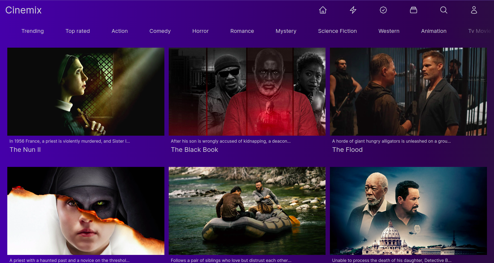

# Cinemix

## Overview

**Cinemix** is a web development project aimed at creating a user-friendly platform for discovering and exploring movies based on their genres. The project communicates with the TMDb (The Movie Database) API to retrieve a wide range of movie data, including titles, descriptions, ratings, release dates, and genres.



## Requirements

- Node.js >= 14.x
- Yarn or npm

## Installation

```bash
# Clone the repository
git clone https://github.com/ahmedmahfoudhi/cinemix.git

# Navigate to the project folder
cd my-nike

# Install dependencies
yarn install

# OR with npm
npm install
```

## Tech Stack
- NextJS: React framework
- Tailwind CSS: Utility-first CSS framework

## Best Practices
- Use functional components and hooks
- Keep components small and focused
- Follow Tailwind's utility-first methodology
